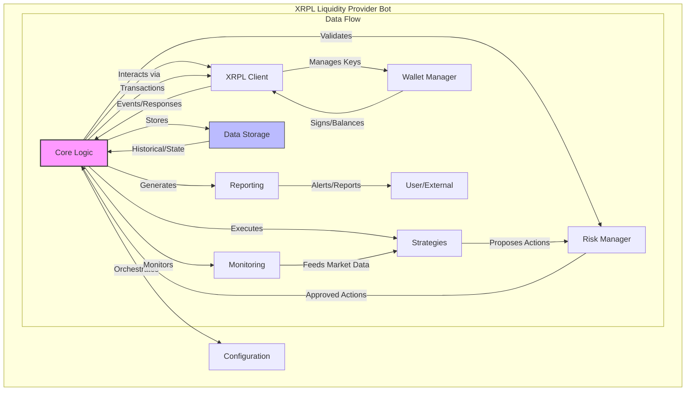

# XRPL Liquidity Provider Bot Architecture

## Overview

The XRPL Liquidity Provider Bot is designed to provide liquidity on the XRP Ledger's decentralized exchange (DEX), which consists of both a Central Limit Order Book (CLOB) and Automated Market Makers (AMMs). The bot aims to generate profits through transaction fees, spread arbitrage, and efficient capital utilization.

## System Architecture

The bot follows a modular architecture with the following main components:

```
┌─────────────────────────────────────────────────────────────────┐
│                        XRPL Liquidity Provider Bot              │
└───────────────────────────────┬─────────────────────────────────┘
                                │
┌───────────────────────────────┼─────────────────────────────────┐
│                               │                                 │
│  ┌─────────────────┐    ┌─────▼────────┐    ┌────────────────┐  │
│  │                 │    │              │    │                │  │
│  │  Configuration  │◄───┤  Core Logic  ├───►│  Data Storage  │  │
│  │                 │    │              │    │                │  │
│  └─────────────────┘    └──────┬───────┘    └────────────────┘  │
│                                │                                 │
│  ┌─────────────────┐    ┌──────┴───────┐    ┌────────────────┐  │
│  │                 │    │              │    │                │  │
│  │  XRPL Client    │◄───┤  Strategies  ├───►│  Risk Manager  │  │
│  │                 │    │              │    │                │  │
│  └────────┬────────┘    └──────┬───────┘    └────────┬───────┘  │
│           │                    │                     │          │
│  ┌────────┴────────┐    ┌──────┴───────┐    ┌────────┴───────┐  │
│  │                 │    │              │    │                │  │
│  │  Wallet Manager │    │  Monitoring  │    │  Reporting     │  │
│  │                 │    │              │    │                │  │
│  └─────────────────┘    └──────────────┘    └────────────────┘  │
│                                                                 │
└─────────────────────────────────────────────────────────────────┘
```

## Enhanced Architecture Diagram (Mermaid)

The following interactive diagram provides a more detailed view of the system architecture and data flows:



## Core Components

### 1. Core Logic

The central component that orchestrates all other modules and implements the main bot loop:

- **Main Loop**: Continuously monitors market conditions, executes strategies, and manages positions
- **Event Handler**: Processes events from the XRPL network (transactions, ledger closes, etc.)
- **Decision Engine**: Evaluates market conditions and decides when to execute strategies

### 2. XRPL Client

Handles all interactions with the XRP Ledger:

- **Connection Manager**: Maintains WebSocket connections to XRPL nodes
- **Transaction Submitter**: Prepares, signs, and submits transactions
- **Response Handler**: Processes responses and errors from the network

### 3. Wallet Manager

Manages the bot's wallets and accounts:

- **Key Management**: Securely stores and manages private keys
- **Account Monitor**: Tracks account balances, trust lines, and LP tokens
- **Transaction Signer**: Signs transactions with the appropriate keys

### 4. Strategies

Implements various liquidity provision strategies:

- **AMM Strategies**: 
  - LP Token Management
  - Fee Optimization
  - Rebalancing Logic
  
- **CLOB Strategies**:
  - Order Book Management
  - Spread Optimization
  - Order Placement/Cancellation Logic

### 5. Monitoring

Monitors the XRPL network and market conditions:

- **Market Monitor**: Tracks prices, volumes, and spreads
- **Network Monitor**: Monitors network throughput and health
- **Token Monitor**: Tracks token adoption and liquidity

### 6. Risk Manager

Manages risk and exposure:

- **Position Limits**: Enforces maximum position sizes
- **Slippage Protection**: Prevents excessive slippage
- **Impermanent Loss Calculator**: Estimates and manages impermanent loss for AMM positions

### 7. Configuration

Manages bot settings and parameters:

- **Config Loader**: Loads configuration from files or environment variables
- **Parameter Validator**: Validates configuration parameters
- **Dynamic Config**: Allows runtime configuration changes

### 8. Data Storage

Stores historical data and bot state:

- **State Manager**: Maintains the current state of the bot
- **Historical Data**: Stores historical market data
- **Analytics Storage**: Stores performance metrics and analytics

### 9. Reporting

Generates reports and notifications:

- **Performance Reporter**: Generates performance reports
- **Alert System**: Sends alerts on critical events
- **Dashboard**: Provides a visual interface for monitoring bot performance

## Data Flow

1. The **Core Logic** initializes all components and starts the main loop
2. The **XRPL Client** connects to the network and subscribes to relevant streams
3. The **Monitoring** component processes market data and network events
4. The **Strategies** component evaluates market conditions and generates actions
5. The **Risk Manager** validates actions against risk parameters
6. The **Core Logic** executes approved actions via the **XRPL Client**
7. The **Wallet Manager** signs transactions and tracks balances
8. The **Data Storage** records actions and results
9. The **Reporting** component generates reports and alerts

## Technology Stack

- **Language**: JavaScript/TypeScript (using xrpl.js library)
- **Runtime**: Node.js
- **Data Storage**: Local database (SQLite) or cloud database (optional)
- **Configuration**: JSON/YAML files and environment variables
- **Logging**: Structured logging with rotation
- **Monitoring**: Prometheus metrics (optional)
- **Dashboard**: Web-based dashboard (optional)

## Deployment Options

- **Local Deployment**: Run on a local machine or server
- **Cloud Deployment**: Deploy to a cloud provider (AWS, GCP, Azure)
- **Containerization**: Docker container for easy deployment
- **High Availability**: Multiple instances with failover (optional)
